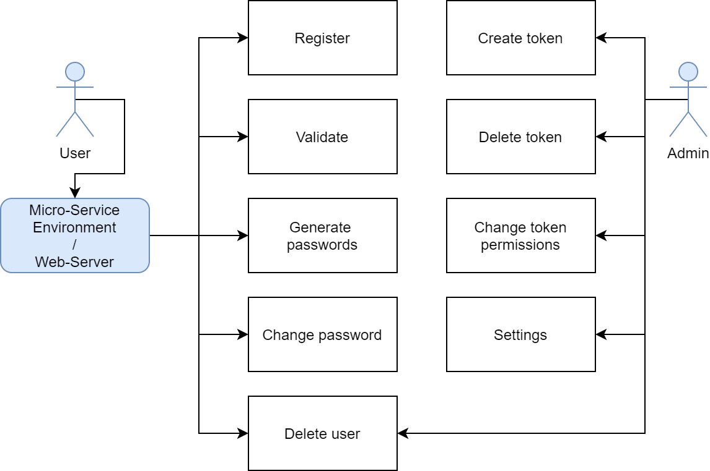
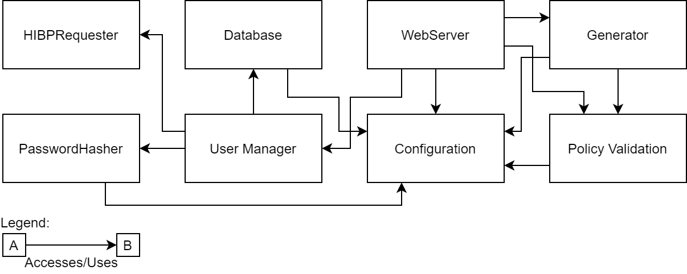
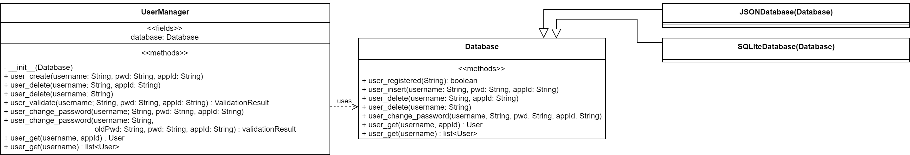
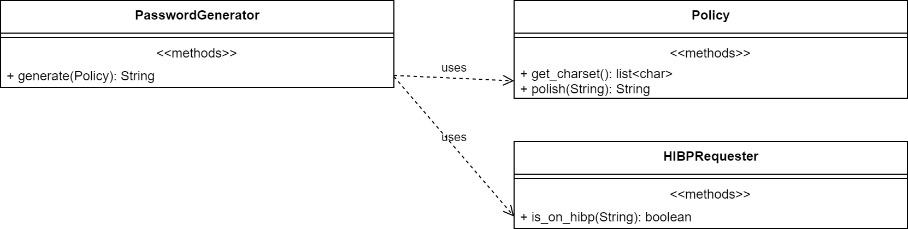
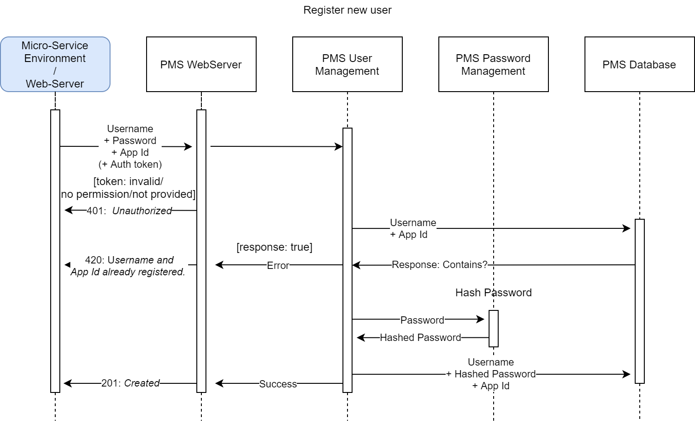
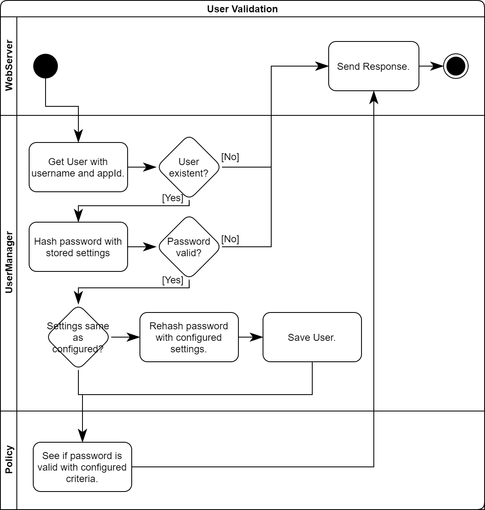
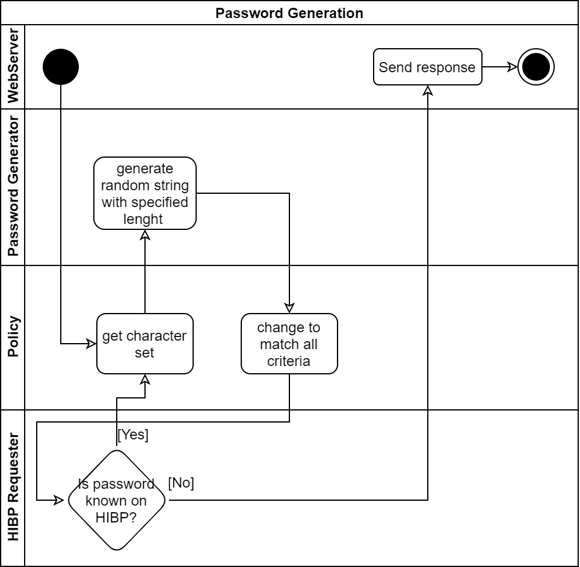

# Password Management System

### Index

[toc]

Figures:\
  1.2.1: [1-1 Use cases](#use-cases)\
  1.2.2: [1-2 Module Overview](#modules)\
  1.2.3.1: [2-1 UML Class Diagram User Management](#user-mngr)\
  1.2.3.2: [2-2 UML Class Diagram Password Generation](#class-pwd-gen)\
  3.1.1: [3-1 Sequence Diagram User Registration](#user-reg)\
  3.1.2: [3-2 Activity Diagram User Validation](#user-val)\
  3.2.1: [3-3 Activity Diagram Password Generation](#act-pwd-gen)

### 1. Introduction

#### 1.1 Description of the Service
   The Password Management System ("PMS", "the Service"), a system to register users, validate username and password on login and password generation. It provides configuration for generating a strong password which can be accessed using an HTTP or Python API entry point. The PMS consists in an overview of 3 parts:
   - The first part is the user management which handles the registration and validation of user accounts also the change of their passwords.
   - The second part provides PMS Admins an interface to change settings, generate authentication tokens for services and stop the service remotely.
   - The third part provides the ability to generate valid passwords, and checking HIBP on generation.

#### 1.2 Overview
##### 1.2.1 Use Cases

> Figure 1-1: Use cases

The actual User should not access the PMS directly, because the System is not supposed to be publicly available. The Admin however, can and should access from the private network in which the system is located. The verification of HIBP is performed by the service on generation of passwords, validation and password change. The Admin has an token which provides privileges to create and moderate other tokens, these are used for authenticating and authorizing other services and admins, the admin possesses also the ability to modify settings of the PMS. 

##### 1.2.2 Module Overview

> Figure 1-2: Module Interaction Overview

The key modules here are clearly "User Manager" and "WebServer", the former is responsible for creating, deleting and validating Accounts, the latter is for hosting the REST-API and perform the actions using the user manager. Almost all modules are accessing the configuration module to requests values like the settings for the hashing algorithm or listening port of the webserver.

##### 1.2.3 Class Overview

  Info: Keep in mind, that all classes and methods/functions which are not been specified here. Are not supposed to be accessed externally.

###### 1.2.3.1  User Management

> Figure 2-1: UML Class Diagram of the User Management

It's possible to implement other Databases Software like MariaDB and MongoDB. Database itself should throw an Error if a not overridden method is used. The hashing is performed by the user manager when needed, the Database however accepts the hashed password. 

###### 1.2.3.2 Password Generation

> Figure 2-2: UML Class Diagram of the Password Generation

The generation is the only part which uses HIPB, the reason is that the client should inform itself if the password used is leaked. 

##### 1.2.3 User Management Overview

### 2. Requirements

#### 2.1 User Management

| ID   | Description                                                  | Dependent Requirements | Unit Test | Notes                                                        |
| ---- | ------------------------------------------------------------ | --------------------- | --------- | ------------------------------------------------------------ |
| UM1  | Service must be able to register users.                      | PM1, PM2               | U1 |                                                              |
| UM2 | Service must be able to store multiple accounts with same username, but for different application (id). |  | U2, U3 | |
| UM3 | Service must be able to validate user with passwords and application id. | UM2 | U4, U5, U6 | Password and application ids are optional (they should of course be validated if given), it's truly possible that an service wants only to check if an user is registered without requiring an password. |
| UM4 | Service must be able to change passwords of users. | UM2 | U7, U8 | Requirement of old password is optional. Not providing an application id, should result of an removal of all accounts with the given username. |
| UM5 | Service must be able to delete account.                     | UM2 | U9, U10 | Requirement of old password is optional.                     |
| UM6 | Service must store usernames in lowercase, and upon validating and registering, compare ignoring cases. | UM2 | |  |

#### 2.2 Password Generation

| ID   | Description                                                  | Dependent Requirements |
| ---- | ------------------------------------------------------------ | ---------------------- |
| PG1  | Service must be able to generate passwords according to specific configured criteria. | PG2                    |
| PG2  | Criteria must be able to be configured.                      |                        |
| PG3  | Service must request HIBP if the generated password is already online, if so, regenerate. | PG1                    |

#### 2.3 Password Management

| ID   | Description                                                  | Dependent Requirements | Notes                                                        |
| ---- | ------------------------------------------------------------ | ---------------------- | ------------------------------------------------------------ |
| PM1  | Service must store password hashed with Argon2id (and store also the settings used). | UM2                    | Ex.: $argon2id$v=19$m=102400,t=2, p=8$tSm+JOWigOgPZx/g44K5fQ$WDyus6py50bVFIPkjA28lQ |
| PM2  | Upon validation, if the settings are changed, the password should be rehashed with the new settings. | UM3                    |                                                              |
| PM3  | Upon validation, the service should inform whether the password is valid in relation to the criteria. | UM3                    |                                                              |

The configuration creates an PasswordHasher instance (`argon2-cffi` library), and than this will be used.

#### 2.4 Python API

##### 2.4.1 database.py/Database
| Method Signature                           | Description                                             |
| ------------------------------------------ | ------------------------------------------------------- |
| user_registered(username, appId) : boolean | Returns if the User is registered.                      |
| user_create(username, pwd, appId)          | Creates new User, and stores in Database.               |
| user_delete(username, appId)               | Deletes user.                                           |
| user_delete(username)                      | Deletes all users with given username.                  |
| user_change_password(username, pwd, appId) | Changes password of an user.                            |
| user_get(username, appId) : User           | Gets user. If no one was found, None shall be returned. |
| user_get(username) : list\<User>           | Gets all users with given username.                     |

##### 2.4.2 UserManager

| Method Signature                                             | Description                                             | Dependent                                                    |
| ------------------------------------------------------------ | ------------------------------------------------------- | ------------------------------------------------------------ |
| __init__(Database)                                           | Constructor.                                            |                                                              |
| user_insert(username, pwd, appId)                            | Inserts new user in the database.                       | database.py/Database#user_create(username, pwd, appId)       |
| user_delete(username, appId)                                 | Deletes user.                                           | database.py/Database#user_delete(username, appId)            |
| user_delete(username)                                        | Deletes all users with given username.                  | database.py/Database#user_delete(username)                   |
| user_validate(username, password, appId) : ValidationResult  | Validates credentials.                                  | database.py/Database#user_get(username, appId) : User        |
| user_change_password(username, old_pwd, pwd, appId) : ValidationResult | Changes password of an user with testing old one.       | database.py/Database#user_change_password(username, pwd, appId) |
| user_change_password(username, pwd, appId)                   | Changes password of an user.                            | database.py/Database#user_change_password(username, pwd, appId) |
| user_get(username, appId) : User                             | Gets user. If no one was found, None shall be returned. |                                                              |
| user_get(username) : list\<User>                             | Gets all users with given username.                     |                                                              |

##### 2.4.3 Other
| File/Class                  | Method Signature             | Description                                          | Dependent                                                    |
| --------------------------- | ---------------------------- | ---------------------------------------------------- | ------------------------------------------------------------ |
| pwdgen.py/PasswordGenerator | generate(Policy) : String    | Generates password with given Policy.                | policy.py/Policy#get_charset() policy.py/Policy#polish(String) |
| policy.py/Policy            | get_charset(): list\<char>   | Gets all chars in the policy.                        |                                                              |
| policy.py/Policy            | polish(String) : String      | If the password is not valid, it will be made valid. |                                                              |
| hibp.py/HIBPRequester       | is_on_hibp(String) : boolean | Returns if the given password is on HIBP.            |                                                              |

#### 2.5 HTTP REST-API

##### 2.5.1 Authentication

| ID   | Description                                                  |
| ---- | ------------------------------------------------------------ |
| HA1  | Every HTTP endpoint, except `/generate`, must be secured with an authentication. Passed with the `token` query parameter. |
| HA2  | The authentication should be with an UUID4 token.            |
| HA3  | If no tokens are created (for example on first startup), the token `adminadm-inad-mina-dmin-adminadminad` should be there on default with all privileges. And on every startup there should be a warning telling to regenerate this token. |
| HA4  | If a token has the permission to create other token, it cannot give permissions to the created one which are forbidden to the first token. |
| HA5  | Service must provide a configuration for disabling authentication on specific endpoints. |
| HA6  | Service must provide an endpoint for regenerating tokens.    |

The authentication is used to restrict access, even inside a private network. This is useful when also other employees have access to this network, but should not change anything to PMS. The default token is needed to configure the network on first usage.

##### 2.5.2 HTTP Endpoints

>  Keep in mind, that on every endpoint, except `/generate`, a `token` parameter should be passed, for authentication and authorization.

| Method | Path                     | Query Parameters                                             | Request Body                                                 | Permission             | Responses                                                    |
| ------ | ------------------------ | ------------------------------------------------------------ | ------------------------------------------------------------ | ---------------------- | ------------------------------------------------------------ |
| POST   | /users                   |                                                              | `{` `  "username": "string",` `  "password": "string(not hashed)",` `  "appId": "string"` `}` | users.create           | 201: Created 400: Bad Request 401: Unauthorized 420: User already exists |
| GET    | /users/{user}/validate   | pwd: password to test on appId: associated appId to the user |                                                              | users.validate         | 200: Valid or not: `{ "valid" : boolean }` 401: Unauthorized 404: User (with this appId) not found |

| Method | Path                     | Query Parameters                                             | Request Body                                                 | Permission             | Responses                                                    |
| ------ | ------------------------ | ------------------------------------------------------------ | ------------------------------------------------------------ | ---------------------- | ------------------------------------------------------------ |
| PATCH  | /users/{user}/change_pwd |                                                              | `{ "new_pw" : "string", "old_pw": "string"}`  ("old_pw" is optional) | users.change_pw        | 200: Changed 401: Unauthorized 404: User not found |
| DELETE | /users/{user}            | appId: associated appId                                      |                                                              | users.delete           | 200: Deleted 401: Unauthorized 404: User not found |
| GET    | /generate                |                                                              |                                                              |                        | 200: Generated password: `{ "pwd" : "string" }`              |
| POST   | /tokens                  |                                                              | An array of permissions: `[ "string" ]`                      | tokens.create          | 200: Created token: `{ "token" : "string" }` 401: Unauthorized |
| GET    | /tokens/permissions      |                                                              |                                                              | tokens.permissions.get | 200: Success: An array of permissions: `[ "string" ]` 401: Unauthorized |
| PATCH  | /tokens/permissions      | token_other: the token                                       | An array of permissions: `[ "string" ]`                      | tokens.permissions.set | 200: Success 400: Bad Request 401: Unauthorized    |
| DELETE | /tokens                  | token_other: the token to delete                             |                                                              | tokens.delete          | 200: Success 400: Bad Request 401: Unauthorized    |
| GET    | /settings                |                                                              |                                                              | settings.get           | 200: Success: An array of settings. `[` `  {` `    "id": "string",` `    "value": value` `  }` `]` |
| PATCH  | /settings                |                                                              | An array of settings: `[{` `    "id": "string",` `    "value": value` `}]` | settings.set           | 200: Success 400: Bad Request 401: Unauthorized    |

### 3 Activity Design

#### 3.1 User Management

##### 3.1.1 User Registration

> Figure 3-1: Sequence Diagram of an User Registration

Endpoint is `POST /users`. This is an internal representation of the registration of an user.

##### 3.1.2 User Validation

> Figure 3-2:  Activity Diagram of the User Verification

Endpoint is `GET /users/{user}/validate`, an appId and a password must be provided.

#### 3.2 Password Management

##### 3.2.1 Password Generation

> Figure 3-3: Activity Diagram of the Password Generation

### 4 Unit Tests

#### 4.1 User Management

To successfully test these test cases, no token should have been created. So on every request, should be with `token` as a query parameter with `adminadm-inad-mina-dmin-adminadminad`  as value. Execute these tests in order.

| ID   | Function                                           | Data to send                                                 | Data to expect |
| ---- | -------------------------------------------------- | ------------------------------------------------------------ | -------------- |
| U1   | Create user                                        | `POST /users`  with  `{` `  "username": "me@ho.me",` `  "password": "just-not-ask",` `  "appId": "default"` `}` as Request Body | HTTP Code: 201 |
| U2   | Create user with same username but different appId | Same as above ↑, but the value of `appId` is `other`         | HTTP Code: 201 |
| U3   | Redo same request                                  | Same as above ↑                                              | HTTP Code: 420 |

|      | Function                                 | Data to send                                                 | Data to expect                               |
| ---- | ---------------------------------------- | ------------------------------------------------------------ | -------------------------------------------- |
| U4   | Validate user                            | `GET /users/me@ho.me/validate?pwd=just-not-ask&appId=default` | HTTP Code: 200 Body: `{"valid": true}`  |
| U5   | Validate user with false password        | `GET /users/me@ho.me/validate?pwd=ask-me&appId=default`      | HTTP Code: 200 Body: `{"valid": false}` |
| U6   | Validate non existent user               | `GET /users/noone@ho.me/validate?pwd=just-not-ask&appId=default` | HTTP Code: 404                               |
| U7   | Change password                          | `PATCH /users/me@ho.ne/change_pwd` with  `{` `  "new_pw": "ask-me-why",` `  "old_pw": "just-not-ask"` `}` as Request Body | HTTP Code: 200                               |
| U8   | Change password from a non existent user | Same as above ↑, but with `PATCH /users/noone@ho.ne/change_pwd` | HTTP Code: 400                               |
| U9   | Delete user                              | `DELETE /users/me@ho.me`                                     | HTTP Code: 200                               |
| U10  | Delete non existent user                 | `DELETE /users/noone@ho.me`                                  | HTTP Code: 404                               |

#### 4.2 Password Generation

Testing should be done so:

1.  Set all settings through `PATCH /settings`.
2.  Generate a password with `GET /generate`.
3.  Test on set criteria.

#### 4.3 Authentication

Test all endpoints with a token which is not registered.\
Then register a token with some permissions, then test all endpoints.
